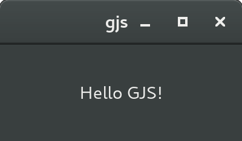

# JSGTK
An attempt to make [GJS](https://wiki.gnome.org/action/show/Projects/Gjs?action=show&redirect=Gjs) more JavaScript and Node.JS friendly, bringing in CommonJS modules loader and indeed able to work with [npm](https://www.npmjs.com/) modules too.

[Related blog post](https://www.webreflection.co.uk/blog/2015/12/08/writing-native-apps-with-javascript)


### Quick How To
In order to install `jsgtk` simply use `npm`
```sh
npm install jsgtk
```
In order to include the `jsgtk` runtime, write the following code at the very top of your file:
```sh
#!/usr/bin/env sh
imports=imports// "exec" "gjs" "-I" "$(dirname $0)/node_modules/jsgtk/" "$0" "$@"
imports.jsgtk.env;

// the rest of your code here, e.g.
console.info('Hello JSGTK');
```
It is now possible to `chmod +x jsgtk-file-name` and launch it directly.


#### Using global npm packages
If `jsgtk` is installed as global `npm` package, we can use it as executable to load programs via it.

```sh
npm install jsgtk -g

echo "console.info('Hello JSGTK!');" > test-gjs.js

jsgtk test-gjs.js
```
Above sequence should log `'Hello JSGTK!'` in console.

The same will work flagging a file header via

```sh
#!/usr/bin/env jsgtk
console.log('Hello JSGTK!');
```


### How to install GJS
It is quite pointless to have `jsgtk` if you don't have a usable version of GJS.
Following how I've installed it in few platforms I could test.


#### Linux

  * in [ArchLinux](https://www.archlinux.org/), a command such `pacman -S --needed npm gjs` would do
  * in [Ubuntu](http://www.ubuntu.com/), a command such `sudo apt-get install npm gjs` should do as well


#### OSX
The easiest way to install GJS in OSX and use JSGTK too is the following sequence of instruction in the terminal.
Feel free to copy and paste below code into `gjs.sh` and then execute it via `sh gjs.sh`.
```sh
# WARNING,  if you have MacPorts already installed you should use it!
#           if you are planning to use WebKitGTK please install MacPorts
if [ "$(which port)" != "" ]; then
  sudo port install gjs
else
  # fallback
  # verify and eventually install Homebrew
  if [ "$(which brew)" = "" ]; then
    ruby -e "$(curl -fsSL https://raw.githubusercontent.com/Homebrew/install/master/install)"
    # eventually confirm or add password the first time it's installed
  fi
  # install gjs via https://github.com/TingPing/homebrew-gnome
  brew tap TingPing/gnome
  brew install gtk+3
  brew install gjs
fi
```
Please note something else might need to be installed, it could take long time to download and install modules, please be patience.


### How to verify everything is OK



If everything went OK, you can now `gjs` in the terminal and play around with `js24` SpiderMonkey CLI.
Please note `gjs` doesn't work as interactively as `node`, in order to run a program you need to launch it via `gjs program.js` or using file headers previously described.
If you'd like to test the look and feel of a basic widget, feel free to save the following code in a `ui.js` file.
```js
#!/usr/bin/env gjs

(function (Gtk){'use strict';

  Gtk.init(null, 0);

  const
    win = new Gtk.Window({
      type : Gtk.WindowType.TOPLEVEL,
      window_position: Gtk.WindowPosition.CENTER
    })
  ;

  win.set_default_size(200, 80);
  win.add(new Gtk.Label({label: 'Hello GJS!'}));
  win.connect('show', () => Gtk.main());
  win.connect('destroy', () => Gtk.main_quit());
  win.show_all();

}(imports.gi.Gtk));
```
Feel free to `chmod +x ui.js` and then launch it directly.


### About the Dark Theme
If there's something I love about [GNOME Desktop](https://www.gnome.org/) is its Adwaita Dark Theme.
The good news is that you can  have it in GJS too trying at least two things:

  * if you know the theme name has a dark variant, use these lines after the init:
```js
Gtk.Settings.get_default().set_property('gtk-application-prefer-dark-theme', true);
Gtk.Settings.get_default().gtk_theme_name = "Adwaita"; // theme name
```

  * set an environment variable either before launching the app `GTK_THEME=Adwaita:dark ./app.js` or in the `~/.bashrc` or `profile` file in order to have it always set
  * use a special header that will also set an environment variable before launching the app

The latter case is summarized in the following header:
```js
#!/usr/bin/env sh
imports=imports// "export" "GTK_THEME=Adwaita:dark" && "exec" "gjs" "-I" "$(dirname $0)/node_modules/jsgtk/" "$0" "$@"
imports.jsgtk.env;

// the rest of your code here
```


### About the Python/C code style
I am working to bring a JS like style through the `jsgtk.gi` import, which is nothing but enriched native API with all aliases that will make methods like `win.set_default_size(200, 80);` become `win.setDefaultSize(200, 80);`, as well as every other method, property, or public static method. This is a work in progress but so far the entire `Gio`, `GLib`, and `GObject` has been covered.

Feel free to check on  top of the [jsgtk.gi](jsgtk/gi.js) file which native module has been patched through `jsgtk.gi` module.


### Stability
Please note while GTK3 is rock solid stable and production ready (GNOME Desktop uses it, to name just one) this project is highly experimental so its JS functionality might not be as perfect as expected. For instance, few File System operations are incomplete and options are partially ignored and not a 1:1 nodejs like solution. I am working on my free time to make this project as stable and reliable as possible, and every kind of contribution will be more than welcome, specially if you are more familiar than I am with GTK3 or even GJS.

Thanks!


### License
This project is under MIT Style license.
```
Copyright (c) 2015 - Andrea Giammarchi & JSGTK Contributors

Permission is hereby granted, free of charge, to any person obtaining a copy
of this software and associated documentation files (the "Software"), to deal
in the Software without restriction, including without limitation the rights
to use, copy, modify, merge, publish, distribute, sublicense, and/or sell
copies of the Software, and to permit persons to whom the Software is
furnished to do so, subject to the following conditions:

The above copyright notice and this permission notice shall be included in
all copies or substantial portions of the Software.

THE SOFTWARE IS PROVIDED "AS IS", WITHOUT WARRANTY OF ANY KIND, EXPRESS OR
IMPLIED, INCLUDING BUT NOT LIMITED TO THE WARRANTIES OF MERCHANTABILITY,
FITNESS FOR A PARTICULAR PURPOSE AND NONINFRINGEMENT.  IN NO EVENT SHALL THE
AUTHORS OR COPYRIGHT HOLDERS BE LIABLE FOR ANY CLAIM, DAMAGES OR OTHER
LIABILITY, WHETHER IN AN ACTION OF CONTRACT, TORT OR OTHERWISE, ARISING FROM,
OUT OF OR IN CONNECTION WITH THE SOFTWARE OR THE USE OR OTHER DEALINGS IN
THE SOFTWARE.
```